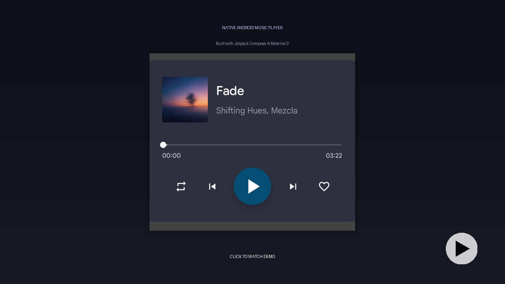

# Music Player Prototype

A functional prototype of a music player widget built with Jetpack Compose according to a Figma spec provided for the purpose of this exercise.

## Demo

**

Watch the demo video to see the player in action, including its UI, features, edge-case handling, and accessibility support.

## Features

This prototype implements the core features of a music player:

*   **Playback:** Play, Pause, Next Track, Previous Track.
*   **Track Info:** Displays Album Art, Title, Artist, and Album.
*   **Progress:** Seekable progress bar showing current time, buffered time, and total duration.
*   **Repeat:** Cycle between Repeat Off, Repeat One, and Repeat All.
*   **Favorite:** Mark or unmark the current track as a favorite.
*   **Gestures:** The entire widget supports multi-touch gestures for pan, zoom, and rotation.

## Technical Details & Highlights

### UI & Layout

*   **Jetpack Compose:** The entire UI is built declaratively with Jetpack Compose.
*   **Custom Progress Bar:** A custom-drawn `Slider` provides visual feedback for playback progress, buffered progress, and a circular scrubber that increases in size on touch for easier interaction.
*   **Marquee Text:** Track titles or artist/album text that is too long for the available space will scroll in a marquee effect to ensure readability.
*   **Responsive Elements:** Button states (e.g., Play/Pause icon) and colors (e.g., Next button disabled) update according to player state.

### Playback Logic

*   **State Management:** A `ViewModel` manages the player state (`MusicPlayerState`) and exposes it to the UI via `StateFlow`.
*   **Audio:** Uses the standard Android `MediaPlayer` for audio playback.
*   **Playlist:** Includes a predefined playlist of tracks, including one track with missing album art and one track that will fail to load.
*   **Previous Track:** Tapping 'Previous' restarts the current track if more than 2 seconds have been played; otherwise, it navigates to the previous track.
*   **Repeat Modes:**
    *   `OFF`: Playback stops after the last track. The 'Next' button is disabled on the last track.
    *   `ONE`: The current track loops indefinitely.
    *   `ALL`: The playlist wraps around (e.g., 'Next' on the last track plays the first track, 'Previous' on the first track plays the last track).
*   **Error Handling:** If a track fails to load (e.g., file not found, corrupted), an error message is displayed, and the player automatically skips to the next track after a 1-second delay.

### Accessibility (a11y)

The prototype includes enhancements for screen reader users (e.g., TalkBack):

*   All buttons have descriptive labels that include state information (e.g., "Pause", "Repeat off; enable repeat one").
*   The progress bar's state is announced in minutes and seconds (e.g., "1 minute 30 seconds") rather than a percentage, providing more meaningful feedback for time-based media.

### Application Behavior

*   **Single Instance:** The main activity uses `launchMode="singleTask"` in `AndroidManifest.xml` to prevent multiple instances of the app from running simultaneously, which avoids issues like multiple audio tracks playing at once if the app is relaunched from the launcher while already running or backgrounded.

## How to Run

This is a standard Android application project that can be opened and run using Android Studio. The audio and image assets are included in the `assets/` directory.
